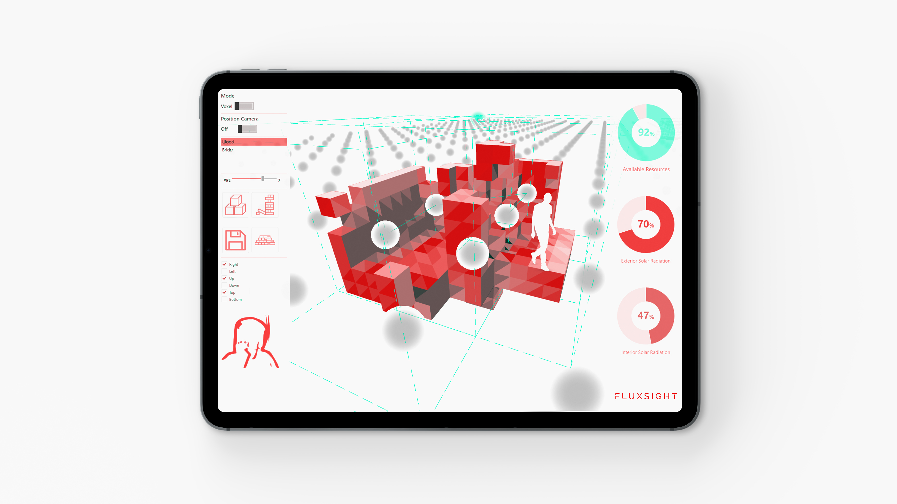

FluxSight
=========
FluxSight is an exploration of non-standard interface methods for sketching design concepts with Rhino and Grasshopper.  

 

Background
----------
This project is positioned as one possible input method for a larger research concerning design and construction using bulk reclaimed materials. Design ideas are fitted out against datasets of possible available materials, and are flexed and adjusted to best make use of the available items in a structural and performant way.  
With this in mind, these design concepts need not be drafted and described in conventional ways, but instead formed in a more broad and gestural manner. Ideally, this allow for greater accessibility in a design process for people not facile with traditional interfaces. Additionally, we look at how relatively low cost and/or deprecated hardware can also improve the reach and accessibility of these systems. 

Hardware
--------
Input devices used:
* Android Phone 
  - HyperIMU : Streams orientation and acceleration data to the computer. Tested with the AKM09912 Orientation sensor. 
  - TouchOSC : Defines arbitrary touch controls on a phone or table. The configuration file used is included in the aux_files folder

* Intel Realsense SR300 : Depth camera 

Grasshopper Plugins
-------------------
The following plugins are used across the project:
- Firefly, GHowl, Heteroptera : Streaming and Network Input
- Human : GUI
- Sunflower : Solar Analysis
- Telepathy : Script Organization
- Yellow : Voxel Editing

Setup
-----
There are three main software parts:
* FF_HandsViewer.exe : Reads from the depth camera and extracts hand skeleton data
* OSCMiddleware : Intercepts and modifies the OSC messages passing from the camera app to Grasshopper, to prevent missed messages
* Grasshopper Scripts : Receives the input from the phone or camera and controls geometry.

All three components are required to be run simultaneously. Be aware that the OSCMiddleware script must be started or restarted after a new Grasshopper file has been loaded. 

Examples and Demo
-----------------

Included are several Grasshopper files demonstrating the technology and the final workflow:
* example_phone_imu : Pointer control and object selection using mobile device IMU orientation
* example_camera_rotation : Example control of rotating a scene using a simple grasping gesture
* example_camera_sculpting : Example editing of a simple voxel scene using several gestures
* fluxsight_demo : Demonstration file of the entire workflow including database comparison and solar analysis
